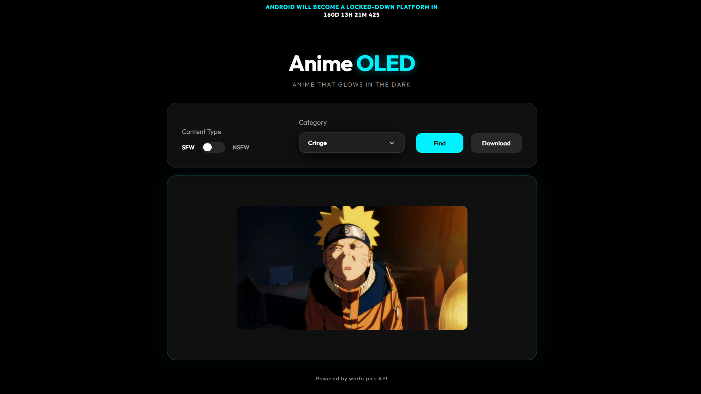

# Anime OLED 🌌

Anime That Glows in the Dark. A premium, AMOLED-friendly anime wallpaper discovery and downloader tool.



[**Live Demo**](https://anime-oled.vercel.app/)

## 🌟 Features

- **AMOLED Optimized:** Designed with deep blacks (`#000000`) to save battery and look stunning on OLED/AMOLED screens.
- **Glassmorphism UI:** Modern, sleek interface with frosted glass effects and smooth transitions.
- **SFW/NSFW Toggle:** Easily switch between content types with a custom-styled toggle.
- **Dynamic Categories:** Choose from dozens of categories including Waifu, Neko, Shinobu, and more.
- **One-Click Download:** Download your favorite wallpapers directly to your device.
- **Responsive Design:** Works flawlessly on both desktop and mobile devices.

## 🛠️ Tech Stack

- **HTML5:** Semantic structure.
- **Vanilla CSS:** Custom properties (variables), Flexbox, Grid, and Glassmorphism effects.
- **JavaScript (ES6+):** Pure JS for DOM manipulation, API fetching, and asynchronous operations.
- **API:** Powered by [waifu.pics](https://waifu.pics)

## 🚀 Getting Started

1. **Clone the repository:**
   ```bash
   git clone git@github.com:Ayushjsgithub/Anime-Oled.git
   ```
2. **Open `index.html`:**
   Simply open the `index.html` file in any modern web browser. No local server or installation required.

## 📱 Usage

1. Select your preferred **Content Type** (SFW or NSFW).
2. Click on the **Category** dropdown to choose a specific theme.
3. Pulse the **Find** button to fetch a random image.
4. Click **Download** to save the image (if the browser blocks direct download, a fallback option will appear).

## 📜 Credits

- Built with ❤️
- Images provided by the [waifu.pics API](https://waifu.pics/docs)

---

_Disclaimer: This tool is for personal use. Content is provided by a third-party API._
