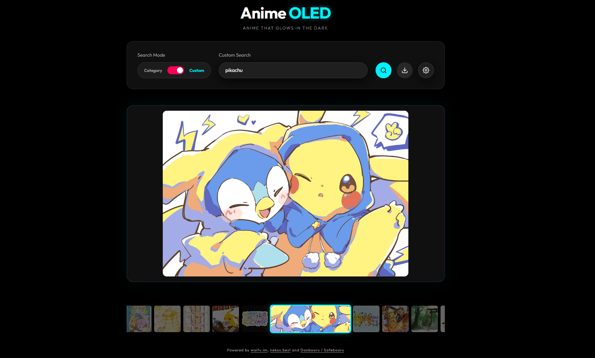

# Anime OLED 🌌

Anime That Glows in the Dark. A premium, AMOLED-friendly anime wallpaper discovery and downloader tool.

<div align="center">
  <a href="https://anime-oled.vercel.app/">
    
  </a>
</div>

## 🌟 Features

- **AMOLED Optimized:** Designed with deep blacks (`#000000`) to save battery and look stunning on OLED/AMOLED screens.
- **Glassmorphism UI:** Modern, sleek interface with frosted glass effects and smooth transitions.
- **SFW/NSFW Toggle:** Easily switch between content types with a custom-styled toggle.
- **Dynamic Categories:** Choose from dozens of categories including Waifu, Neko, Shinobu and more.
- **Custom Search Engine:** Search for anything you want using a flexible keyword search powered by Danbooru/Safebooru.
- **One-Click Download:** Download your favorite wallpapers directly to your device.
- **Responsive Design:** Works flawlessly on both desktop and mobile devices.

## 🛠️ Tech Stack

- **HTML5:** Semantic structure.
- **Vanilla CSS:** Custom properties (variables), Flexbox, Grid, and Glassmorphism effects.
- **JavaScript (ES6+):** Pure JS for DOM manipulation, API fetching, and asynchronous operations.
- **API:** Powered by [waifu.im](https://waifu.im), [nekos.best](https://nekos.best) and [Danbooru](https://danbooru.donmai.us) / [Safebooru](https://safebooru.org).

## 🚀 Getting Started

1. **Clone the repository:**
   ```bash
   git clone git@github.com:Ayushjsgithub/Anime-Oled.git
   ```
2. **Open `index.html`:**
   Simply open the `index.html` file in any modern web browser. No local server or installation required.

## 📱 Usage

1. **Settings Drawer:** Click **Settings** ⚙️ to open the drawer and toggle your preferred **Content Type** (SFW or NSFW).
2. **Search or Select:** Use the toggle to switch between **Category** (dropdown selection) and **Search** (custom tag input) modes.
3. **Fetch Images:** Click **Find** 🔍 to load a collection of random images.
4. **Carousel & Thumbnails:** Use the left/right ⬅️/➡️ arrows on the image or the thumbnails below it to browse through your fetched images.
5. **Download:** Click **Download** ⬇️ to save your favorite image directly to your device.

## 📜 Credits

- Built with ❤️
- Images provided by the [waifu.im API](https://docs.waifu.im/docs/intro), [nekos.best](https://nekos.best) and [Danbooru](https://danbooru.donmai.us) / [Safebooru](https://safebooru.org).

---

_Disclaimer: This tool is for personal use. Content is provided by a third-party API._
